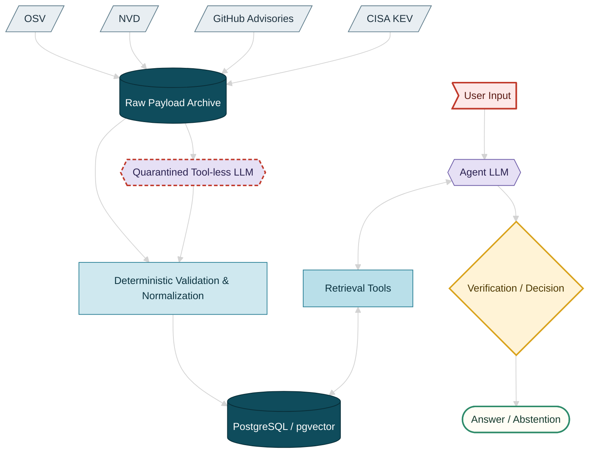

```mermaid

%%{init: {
  'theme': 'dark',
  'themeVariables': {
    'darkMode': true,
    'background': '#121212',
    'fontFamily': 'Inter, system-ui, sans-serif',
    'fontSize': '14px'
  }
}}%%

flowchart TB

    classDef untrusted fill:#fde8e8,stroke:#c0392b,color:#5a1a14,stroke-width:2px
    classDef source fill:#e8eef2,stroke:#5d7b8a,color:#1f3340
    classDef store fill:#0f4c5c,stroke:#082d37,color:#ffffff
    classDef code fill:#cfe8ef,stroke:#2a7f95,color:#0b3340
    classDef llm fill:#e6e0f5,stroke:#6c5ba7,color:#2a2150
    classDef quarantine fill:#e6e0f5,stroke:#c0392b,color:#2a2150,stroke-width:2px,stroke-dasharray:5 3
    classDef gate fill:#fff3d6,stroke:#d9a21b,color:#4d3800,stroke-width:2px
    classDef output fill:#fffdf5,stroke:#2e8b6a,color:#14392c,stroke-width:2px
    classDef tool fill:#b9dfe9,stroke:#2a7f95,color:#0b3340

    UserInput>"User Input"]:::untrusted

    Database[("PostgreSQL / pgvector")]:::store

    SourceOSV[/OSV/]:::source
    SourceNVD[/NVD/]:::source
    SourceGHSA[/GitHub Advisories/]:::source
    SourceKEV[/CISA KEV/]:::source

    RawPayloadArchive[(Raw Payload Archive)]:::store
    QuarantinedParser{{"Quarantined Tool-less LLM"}}:::quarantine
    DeterministicValidation["Deterministic Validation & Normalization"]:::code

    SourceOSV --> RawPayloadArchive
    SourceNVD --> RawPayloadArchive
    SourceGHSA --> RawPayloadArchive
    SourceKEV --> RawPayloadArchive

    RawPayloadArchive --> QuarantinedParser
    RawPayloadArchive --> DeterministicValidation
    QuarantinedParser --> DeterministicValidation
    DeterministicValidation --> Database

    Retrieval["Retrieval Tools"]:::tool
    LLM{{"Agent LLM"}}:::llm

    UserInput --> LLM
    LLM <--> Retrieval
    Retrieval <--> Database

    GateOrDecision{"Verification / Decision"}:::gate
    Output(["Answer / Abstention"]):::output

    LLM --> GateOrDecision
    GateOrDecision --> Output
```

